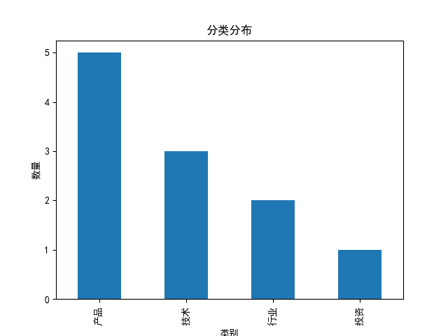
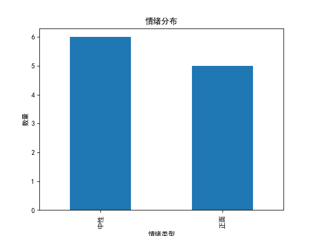
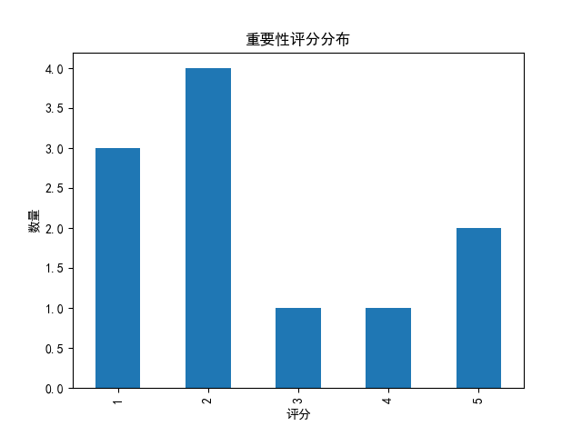

AI行业分析报告
========

# AI行业分析报告

## 一、总体概览

- 总新闻数：11
- 高重要性事件：3（27.27%）
- 头部公司占比：63.64%

## 二、今日热点

- I/O大会开完，谷歌连搜索框都变智能体了（评分:5，类别:产品）
- 高潮从第几秒开始？GaMMA 让多模态大模型真正「听懂」音乐时间线（评分:5，类别:技术）
- 520，遇见国产「新模王」Qwen3.7-Max！（评分:4，类别:技术）
- 谷歌在I/O 2026上更新Gemini应用，与ChatGPT和Claude竞争（评分:3，类别:产品）
- 2026中国AIGC最值得关注的企业&产品图鉴来了！谁在造浪，谁在落地？（评分:2，类别:行业）

## 三、分类分析

- 产品：5条，代表事件：I/O大会开完，谷歌连搜索框都变智能体了
- 技术：3条，代表事件：高潮从第几秒开始？GaMMA 让多模态大模型真正「听懂」音乐时间线
- 投资：1条，代表事件：告别信息流：Status AI 融资1700万美元，将社交媒体转变为互动娱乐
- 行业：2条，代表事件：2026中国AIGC最值得关注的企业&产品图鉴来了！谁在造浪，谁在落地？

## 四、技术趋势

- 多模态（6次）
- LLM（5次）
- 智能体（3次）
- 多智能体协同（1次）
- 隐性知识捕获（1次）

## 五、数据可视化

分类分布

情绪分布

重要性分布

## 六、风险与机会

风险：
- 暂无明显风险

机会：
- Agent方向持续升温
